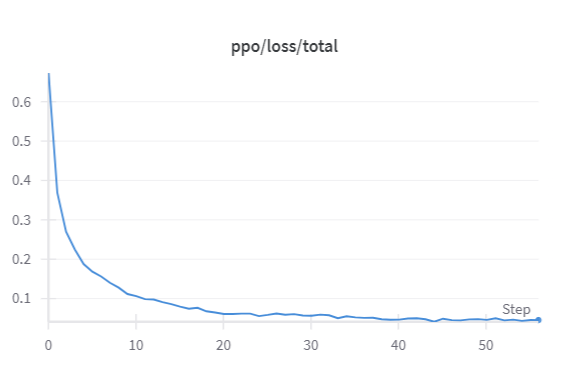
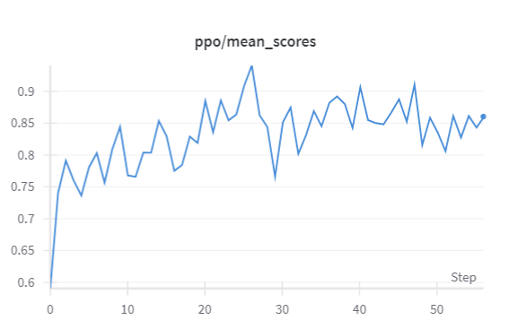

# PPO-RLHF: 基于强化学习的 LLM 情感对齐

使用 **PPO (Proximal Policy Optimization)** 算法对 **Qwen2.5-0.5B-Instruct** 进行 RLHF 微调，使其在续写电影评论时倾向于生成积极正面的内容。

## 训练流程

```
┌─────────────────────────────────────────────────────────────────────┐
│                        PPO 训练流程                                  │
│                                                                     │
│  ┌──────────┐    ┌──────────────┐    ┌──────────────┐              │
│  │ IMDB 影评 │───▶│ 截取前10 token │───▶│ Qwen Chat    │              │
│  │ 数据集    │    │ 作为 Prompt   │    │ Template 包装│              │
│  └──────────┘    └──────────────┘    └──────┬───────┘              │
│                                             │                      │
│                                             ▼                      │
│  ┌──────────────────────────────────────────────────────┐          │
│  │              策略模型 (Policy Model)                   │          │
│  │         Qwen2.5-0.5B-Instruct + Value Head            │          │
│  │              生成续写 (最多 128 token)                  │          │
│  └──────────────────────────┬───────────────────────────┘          │
│                              │                                      │
│                              ▼                                      │
│  ┌──────────────────────────────────────────────────────┐          │
│  │              奖励模型 (Reward Model)                   │          │
│  │        DistilBERT 情感分类 → POSITIVE 概率作为奖励      │          │
│  └──────────────────────────┬───────────────────────────┘          │
│                              │                                      │
│                              ▼                                      │
│  ┌──────────────────────────────────────────────────────┐          │
│  │                    PPO 更新                            │          │
│  │  最大化奖励 + KL 散度惩罚 (防止偏离参考模型过远)         │          │
│  └──────────────────────────────────────────────────────┘          │
│                                                                     │
│  ┌──────────────────────────────────────────────────────┐          │
│  │  参考模型 (Reference Model)                            │          │
│  │  Qwen2.5-0.5B-Instruct 原始副本 (冻结, 不更新)         │          │
│  │  用于计算 KL 散度, 约束策略模型不要偏离太远              │          │
│  └──────────────────────────────────────────────────────┘          │
└─────────────────────────────────────────────────────────────────────┘
```

## 核心设计

### PPO 算法配置

| 参数 | 值 | 说明 |
|------|-----|------|
| `learning_rate` | 6e-6 | 较小学习率，避免策略更新过大导致崩溃 |
| `batch_size` | 128 | 每次 PPO 优化前收集的 prompt 数量 |
| `mini_batch_size` | 16 | 128 条数据分 8 个 mini-batch 处理，节省显存 |
| `target_kl` | 0.03 | KL 散度目标阈值，动态调节惩罚强度 |
| `ppo_epochs` | 1 | 每个 batch 只做 1 轮 PPO 更新 |
| `use_score_norm` | True | 标准化奖励分数，稳定训练 |

### KL 散度惩罚机制

```
KL > target_kl (0.03)  → λ 增大 → 惩罚更重 → 策略被拉回来
KL < target_kl (0.03)  → λ 减小 → 惩罚更轻 → 策略可以探索
```

KL 散度衡量当前策略模型与参考模型的差异。通过 `target_kl` 动态调节惩罚系数 λ，使策略模型既能探索更好的生成策略，又不会偏离原始模型太远导致生成质量退化。

### 为什么没有单独的 Value Model？

在 TRL 库的设计中，价值头 (Value Head) 被直接集成到策略模型中：

```
Qwen 底层 (Transformer layers)
      ↓ hidden_states
      ├── LM Head: Linear(2048 → vocab_size)  → 下一个 token 的概率分布（策略）
      └── Value Head: Linear(2048 → 1)        → 当前状态的价值评估（价值）
```

好处：参数共享、训练效率高、架构简化。

### 生成参数设计

训练时使用完全随机采样 (`do_sample=True`, `top_k=0`, `top_p=1.0`)，这是 PPO 训练的需要：
- 高多样性 → 得到各种质量的回复 → 奖励信号有差异 → 策略模型能学到"什么好、什么不好"

## 项目结构

```
PPO/
├── README.md                # 项目说明
├── LICENSE                  # MIT License
├── requirements.txt         # Python 依赖
├── train_ppo_qwen.py        # 主训练脚本 (约 580 行, 详细中文注释)
├── images/
│   ├── ppo_total_loss.png   # 训练 loss 曲线
│   └── ppo_mean_score.png   # 平均奖励分数曲线
├── distilbert/              # 奖励模型 (需从 HuggingFace 下载)
│   ├── config.json
│   ├── pytorch_model.bin    # 已 gitignore
│   └── ...
└── data/
    └── imdb/                # IMDB 数据集 (需从 HuggingFace 下载)
        └── plain_text/
            ├── train-00000-of-00001.parquet
            ├── test-00000-of-00001.parquet
            └── unsupervised-00000-of-00001.parquet
```

## 快速开始

### 环境配置

```bash
# 创建 conda 环境
conda create --name ppo python=3.10
conda activate ppo

# 安装依赖
pip install -r requirements.txt
```

### 下载模型和数据

代码中已配置从 HuggingFace 自动加载。如果网络受限，使用镜像：

```bash
export HF_ENDPOINT=https://hf-mirror.com
```

### 运行训练

```bash
python train_ppo_qwen.py
```

训练过程会输出每步的平均奖励和 PPO Loss。训练完成后会自动对比训练前后模型的生成效果。

### 实验监控（可选）

代码中已预留 WandB 集成，取消注释即可启用：

```python
# 在 train_ppo_qwen.py 中取消 WandB 相关注释
log_with="wandb"  # PPOConfig 中
wandb.init(...)    # 训练循环前
```

## 训练结果

训练过程 Loss 曲线：



平均奖励分数变化：



## 关键依赖

| 库 | 版本 | 用途 |
|----|------|------|
| `trl` | 0.8.6 | PPOTrainer、AutoModelForCausalLMWithValueHead |
| `transformers` | 4.40.2 | 模型加载、tokenizer |
| `accelerate` | 0.29.3 | 分布式训练、设备管理 |
| `datasets` | 2.18.0 | IMDB 数据集加载 |

## License

MIT
